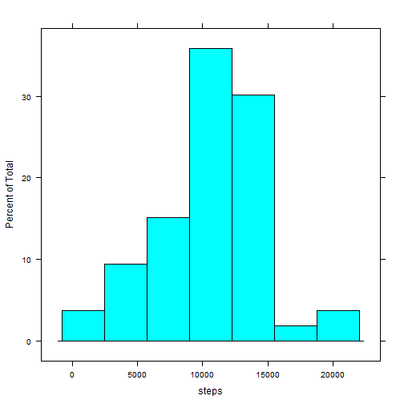
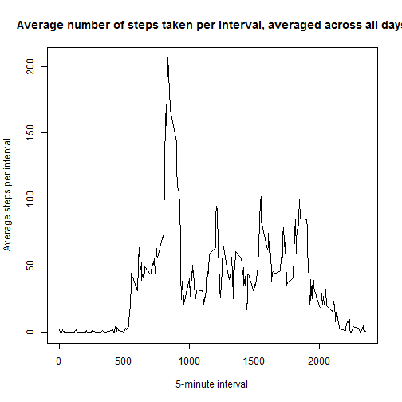
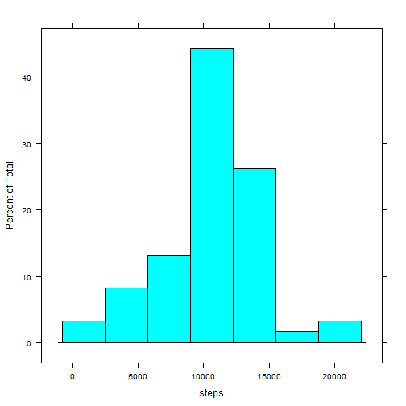
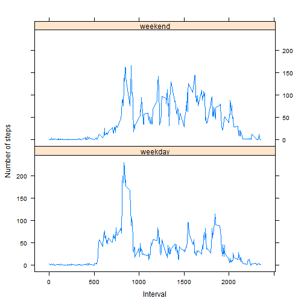

## Loading and preprocessing the data
Load required libraries and set options


```r
library(ggplot2)
library(lattice)

options(scipen=10)
```

Unzip the activity.zip file and read it into R

```r
if (!file.exists("activity.csv") && file.exists("activity.zip")) 
{
    dataFile <- unzip("activity.zip")
}
activityData <- read.csv("activity.csv", header=TRUE)
```
Transform the date column into a date class


```r
activityData$dateClass <- strptime(activityData$date, format="%Y-%m-%d")
```

## What is mean total number of steps taken per day?

1. Calculate the number of steps taken per day


```r
stepsByDay <- aggregate(steps ~ date, data=activityData, sum)
str(stepsByDay)
```

```
## 'data.frame':	53 obs. of  2 variables:
##  $ date : Factor w/ 61 levels "2012-10-01","2012-10-02",..: 2 3 4 5 6 7 9 10 11 12 ...
##  $ steps: int  126 11352 12116 13294 15420 11015 12811 9900 10304 17382 ...
```

2. Make a histogram of the total number of steps taken each day


```r
histStepsPerDay <- histogram(date ~ steps, data=stepsByDay)
plot(histStepsPerDay)
```

 

3. Calculate and report the mean and median of the total number of steps taken per day

The mean of the total number of steps per day is 10766.1886792 and the median is 10765.

## What is the average daily activity pattern?

1. Make a time series plot (i.e. type = "l") of the 5-minute interval (x-axis) and the average number of steps taken, averaged across all days (y-axis)


```r
avgStepsOverInterval <- aggregate(steps ~ interval, data=activityData, FUN=mean)
str(avgStepsOverInterval)
```

```
## 'data.frame':	288 obs. of  2 variables:
##  $ interval: int  0 5 10 15 20 25 30 35 40 45 ...
##  $ steps   : num  1.717 0.3396 0.1321 0.1509 0.0755 ...
```

```r
plot(avgStepsOverInterval$interval, avgStepsOverInterval$steps, type="l"
    , main="Average number of steps taken per interval, averaged across all days"
    , xlab="5-minute interval", ylab="Average steps per interval")
```

 

2. Which 5-minute interval, on average across all the days in the dataset, contains the maximum number of steps?

The 5-minute interval with the maximum number of steps (206.1698113) is 835.

## Imputing missing values

1. Calculate an report the total number of missing values in the dataset (i.e. the total number of rows with ``NA``s)

The total number of missing values for steps in the dataset is 2304.

2. Strategy for addressing the missing values: fill in the missing values of the dataset using the mean for the corresponding 5-minute interval.

3. Create a new dataset that is equal to the original dataset but with the missing data filled in.


```r
imputeNA <- function(x, y) replace(x, is.na(x)
                                   , avgStepsOverInterval$steps[avgStepsOverInterval$interval==y])

activityData$imputedSteps <- mapply(FUN=imputeNA, activityData$steps
                                    , activityData$interval)

activityData2 <- data.frame(steps=as.integer(activityData$imputedSteps)
                            , date=activityData$date, interval=activityData$interval
                            , dateClass=activityData$dateClass)

str(activityData2)
```

```
## 'data.frame':	17568 obs. of  4 variables:
##  $ steps    : int  1 0 0 0 0 2 0 0 0 1 ...
##  $ date     : Factor w/ 61 levels "2012-10-01","2012-10-02",..: 1 1 1 1 1 1 1 1 1 1 ...
##  $ interval : int  0 5 10 15 20 25 30 35 40 45 ...
##  $ dateClass: POSIXct, format: "2012-10-01" "2012-10-01" ...
```

4. Make a histogram of the total number of steps taken each day and calculate and report the **mean** and **median** total number of steps taken per day.


```r
stepsByDay2 <- aggregate(steps ~ date, data=activityData2, sum)
histStepsPerDay2 <- histogram(date ~ steps, data=stepsByDay2)
plot(histStepsPerDay2)
```

 

The mean of the total number of steps per day is 10749.7704918 and the median is 10641.

    + Do these values differ from the estimates from the first part of the assignment?
    
**Yes**
    
    + What is the impact of imputing missing data on the estimates of the total daily number of steps?
    
**It lowers the mean slightly, and the median more significantly**
    
## Are there differences in activity patterns between weekdays and weekends?

1. Create a new factor variable in the dataset with two levels -- "weekday" and "weekend" indicating whether a given date is a weekday or weekend day.  I elected not to use the ``weekdays()`` function, as it returns the weekday name in the local language.


```r
dayClasses <- c("1"="weekday","2"="weekday","3"="weekday","4"="weekday"
                ,"5"="weekday","6"="weekend","7"="weekend")
activityData2$dayClass <- factor(dayClasses[strftime(activityData2$dateClass
                                                     , format="%u")])
str(activityData2)
```

```
## 'data.frame':	17568 obs. of  5 variables:
##  $ steps    : int  1 0 0 0 0 2 0 0 0 1 ...
##  $ date     : Factor w/ 61 levels "2012-10-01","2012-10-02",..: 1 1 1 1 1 1 1 1 1 1 ...
##  $ interval : int  0 5 10 15 20 25 30 35 40 45 ...
##  $ dateClass: POSIXct, format: "2012-10-01" "2012-10-01" ...
##  $ dayClass : Factor w/ 2 levels "weekday","weekend": 1 1 1 1 1 1 1 1 1 1 ...
```

2. Make a panel plot containing a time series plot (i.e. type = "l") of the 5-minute interval (x-axis) and the average number of steps taken, averaged across all weekday days or weekend days (y-axis). 


```r
avgStepsOverInterval2 <- aggregate(steps ~ interval + dayClass, data=activityData2, FUN=mean)
str(avgStepsOverInterval2)
```

```
## 'data.frame':	576 obs. of  3 variables:
##  $ interval: int  0 5 10 15 20 25 30 35 40 45 ...
##  $ dayClass: Factor w/ 2 levels "weekday","weekend": 1 1 1 1 1 1 1 1 1 1 ...
##  $ steps   : num  2.1556 0.4 0.1556 0.1778 0.0889 ...
```

```r
xyplot(steps ~ interval | dayClass, data=avgStepsOverInterval2, layout= c(1,2)
       , type="l", xlab="Interval", ylab="Number of steps")
```

 
